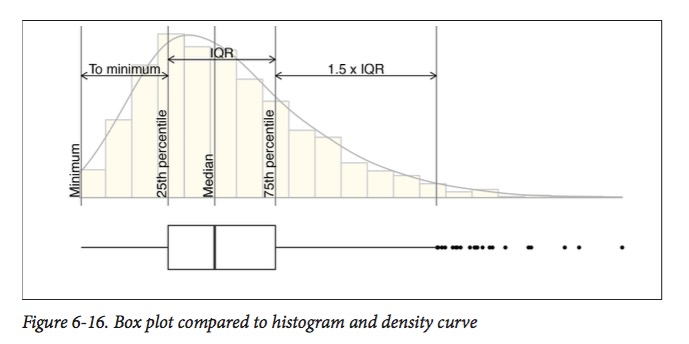

# Definición

Un Diagrama de caja, también conocido como diagrama de caja y bigotes, es un gráfico que está basado en cuartiles y mediante el cual se visualiza la distribución de un conjunto de datos. Está compuesto por un rectángulo, la "caja", y dos brazos, los "bigotes".

## Qué podemos aprender?

Podemos aprender el valor mínimo, el máximo, los cuartiles Q1, Q2 y Q3 y el rango inter-cuartílico (RIC):

# Tutorial


```{r setup, include=FALSE}
library(ggplot2)
```

Nos ayuda a comparar distribuciones

## Comparación entre gráficos

A box plot consists of a box and “whiskers.” The box goes from the 25th percentile to the 75th percentile of the data, also known as the inter-quartile range (IQR).
The whiskers start from the edge of the box and extend to the furthest data point that is within 1.5 times the IQR.



## Gráfico de caja básico

```{r}
ggplot(ToothGrowth, aes(x=supp, y=len)) + geom_boxplot()
```

## Cambiar el ancho del gráfico

Cambia el ancho con width

```{r}
ggplot(ToothGrowth, aes(x=supp, y=len)) + geom_boxplot(width=0.1)
```

Los outliers están representados como puntos

## Agregar muescas al plot

```{r}
ggplot(ToothGrowth, aes(x=supp, y=len)) +  geom_boxplot(notch=TRUE)
```

## Hacer un gráfico violín

Violin plots are a way of comparing multiple data distributions. With ordinary density curves, it is difficult to compare more than just a few distributions because the lines visually interfere with each other. With a violin plot, it’s easier to compare several dis‐ tributions since they’re placed side by side.

```{r}
ggplot(ToothGrowth, aes(x=supp, y=len)) +  geom_violin()
```

## Gráfico violín

```{r}
p<-ggplot(ToothGrowth, aes(x=supp, y=len)) +  geom_violin()
p + geom_violin() + geom_boxplot(width=.1, fill="black") + stat_summary(fun.y=median, geom="point", fill="white", shape=21, size=2.5)
```

##  Gráfico de Sara

```{r}
getwd()
#setdw()
datos<-read.table(file = "efectos_medicina_ALS.tsv", header = TRUE)
ggplot(datos, aes(x = paciente, y = efecto)) + geom_violin(color="blue")
```


```{r}


View(datos)
ggplot(datos, aes(x = dosis, y = efecto)) + geom_boxplot(width = 0.1) + geom_violin()


```